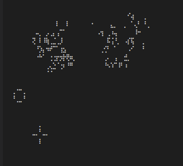

# REPLGameOfLife
*This is a proof of concept.*

Play [Conways Game Of Life](https://en.wikipedia.org/wiki/Game_of_life) directly in the Julia REPL!
This uses braille symbols to increase resolution and rendering speed, similar to the `BrailleCanvas` from [UnicodePlots.jl](https://github.com/Evizero/UnicodePlots.jl)

Playing in the VSCode REPL:



## Installation

## Playing
After Installation, use the Package (`using REPLGameofLife`) and start a game with `gameoflife()` or its short form `gol()`.

Keyword arguments:
* `pause`: Set the time between frames
* `survive`: How many live neighbors are needed to survive
* `birth`: how many live neighbors are needed for a birth

## Environments and Presets
You can provide a starting environment as an array of 1's and 0's:
```julia
gol([
    0 0 0 0 0 0
    0 0 0 1 0 0
    0 0 0 0 1 0
    0 0 1 1 1 0
    0 0 0 0 0 0
])
```

Alternatively you can start `gol(p::Preset, size::Tuple(Int,Int))` using a preset:

```julia
gameoflife(Glider(), (40, 40))
```

Currently only two Presets are provided:
* Glider
* BHeptomino

PRs are welcome!
